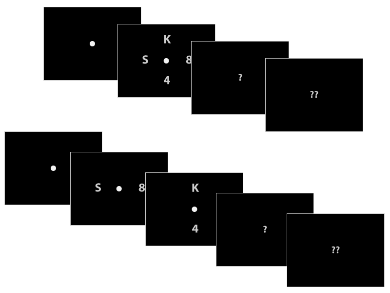

# Instructions

In this experiment, you will be presented with a set of numbers and letters on a screen, and then will be asked to report which letters you saw. 

## Stimuli

During each trial, you will first be presented with a fixation dot in the middle of the screen. This fixation dot marks the beginning of a single trial. Then a set of letters and numbers will briefly appear and then disappear. Afterwards, you'll see a question mark appear prompting you to report via the keyboard which letters appeared on the screen. Once you've reported the letters, the trial will end and the next one will begin.

On some set of trials, you will see 4 characters appear simultaneously on the screen (2 letters + 2 numbers). On another set of trials, 2 characters (1 letter + 1 number) will appear, then will disappear, followed by another pair of characters.

## Task
Your task in this experiment is to **report which 2 letters appeared in single trial** via the keyboard. 

- When you see a 1 question mark, enter in one of the letters you saw. 
- When you see 2 question marks, enter in the other letter you saw. 
- Order does not matter. 

Throughout the trial, the brightness of the colors will change. So, even if you have a hard time seeing the letters, just **make your best guess** as to which 2 letters were presented. Typically, in the beginning the letters will be hard to see, so don't worry if you have to make a guess at the start. 

